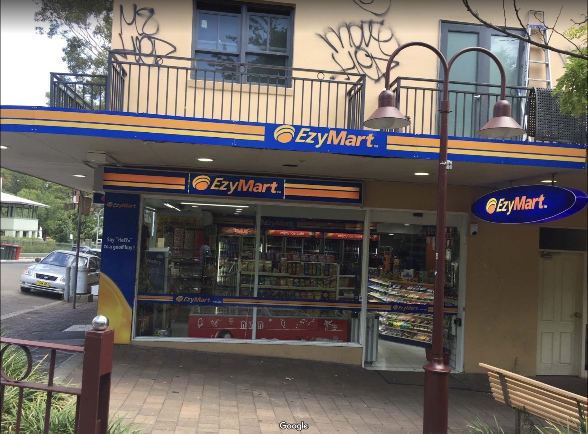

# Unit 2
{: .no_toc }

## Choosing where to buy and; Key factors affecting consumer decisions
{: .no_toc }

### just use ebay!
{: .no_toc }

<label class="label label-blue">In-Progress</label>

#### Table of Contents
{: .no_toc }

* Table of Contents
{:toc}

***

**It's important to note that I really don't think they are going to test us on Mail order. So if you are time poor (haha get it) then maybe skip this unit and move onto the next one.**

## Different prices

1. Manufacture price – price wholesalers pay
2. Wholesale price – price retailers pay
3. RRP (reommended retail price) – normal selling price at retail stores
4. Discount price – any price below the RRP

This is an examble of a distribution chain:

## Where can you buy?

### Mail order
- allows you to purchase using an order form
- large range of products and accessible for those in rural or remote communities
- less customer service, including refunds and returns
- products can be different than what is depicted

Example of mail order form for guns and ammunition: 

### Online shopping
- allows consumers who are 'time poor' access to a large range
- ACL is not normally enforceable for overseas purchases
- products can be cheaper and it is easier to do price comparisons
- quick delivery
- returns and refunds can be difficult
- there are many Internet scams

Example of online shopping for 6 pack Hawaiian pineapples: 

### Types of retail outlets

#### Convenience stores

- Located in many locations and sell a large variety of products, most commonly food items, magazines and newspapers
- Usually more expensive and lower range, but more convenience

*Ezymart near my school in Kirribilli, NSW, Australia. Also students are banned from going there by my school.*

#### Specialty stores

- Stores that specialise in one type of product or service
- Some are part of a large franchise chain
- Their main advantage of specialty stores is service and product knowledge

*The Apple Store in Sydney, NSW, Australia. My wallet is burning.*

#### Discount variety stores

- Stores that offer basic customer service
- Extremely low prices

*The Kmart store in Chatswood, NSW, Australia. They have ridiculously cheap candy.*

#### Department stores

- Large range of products
- Prices are cheaper than speciality stores but higher than discount variety
- Some sales assistance

*We tried looking for a picture of a Myer store in Darwin, NT, Australia. There isn't any.*

#### Supermarkets

- Large, self-serve stores such as Woolworths, Aldi and Coles
- Originally sold food items but are now like discount variety stores with a large range of items

THe Woolies Metro at Chatswood Train Station, Chatswood, NSW, Australia. It's aisles are lined with candy.

## Locally, regionally, interstate, or globally?

1. ### Locally

A consumer will usually purchase food and small essentials at their local convenience store or shopping arcade. *Unless you live in Chatswood! I love the library so much! It's so close to the Chatime!*

*The Spitroast at Artarmon, NSW, Australia. Now closed and replaced by a knockoff but at least they still sell marathon spring rolls.*

2. ### Regionally

Department stores, discount department stores and supermarkets are located in regional shopping complexes. They are located under one roof and provide lots of parking.

*The Westfield in Chatswood, NSW, Australia. A nice place to *cough cough* study with friends... next to the KFC and the Optus store*

3. ### Interstate or globally

Customers now can purchase goods from interstate or globally. This is made possible due to gloablisation and technology. 

*NomNomz Plush Dog Toy - Pineapple on eBay, available from Peregian Beach, Qld, Australia*

***

## Key factors affecting consumer decisions

- Service: how a customer is treated can determine whether they return to a store/buy that product in the future.
- Price: how much a product is – customers want value for money
- Convenience: how easy it is – location, number of stores, opening hours
- Marketing: successful marketing campaigns can influence a business' growth
- Gender and age: needs and wants vary between different groups(but they can also be the same!)
- Finance: how easy is it to get out of a loan, and is it worth it?
- Environmental: more environmentally friendly products can incentivise a customer to purchase it