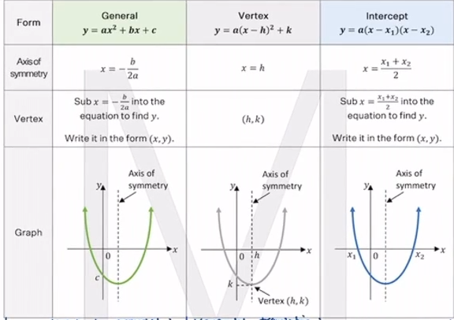

# In a Nutshell: Parabola Forms
## part of the In a Nutshell series on Adrian's Study Club

<label class="label label-green">Complete</label>

### Factored form `y=a(x-x_1)(x-x_2)`

Given: 
1. 2 x-ints
2. One other point `P(x,y)

### Vertex Form `y=a(x-h)^2 + k`

Given:
1. Vertex `V(h,k)`
2. `P(x, y)`

### General Form `y=ax^2 + bx + c`

Given:
1. 3 points

OR

1. 2 points
2. y-int where `y-int = c`

OR

1. Axis of symmetry `x=-(b/2a)
2. 2 other points

***

|Form    |**General** `y = ax^-2 + bx + c`    |**Vertex** `y =a (x-h)^2 + k`   |**Intercept** `y=(x-x_1)(x-x_2)`    |
|:---|:--:|:--:|:--:|
|Axis of symmetry    |`x = -(b/2a)`    |`x = h`    |`x=((x_1 + x_2)/2)`    |
|Vertex    |Sub `x = -(b/2a)` into the equation to find `y`.    |`(h, k)`    |Sub `x=((x_1 + x_2)/2)` into the equation to find y.   |

|Form|**Vertical Translation** `y = ax^2 + c`| **Horizontal translation** `y=a(x-h)^2`|
|:---|:--:|:--:|:--|
|Axis of symmetry|`x=0` (y-axis)|`x=h`|
|Vertex|`V(O,c)`|`V(h,0)`|

