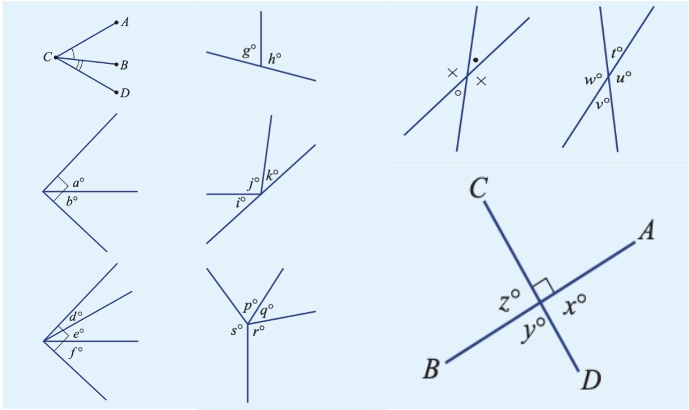
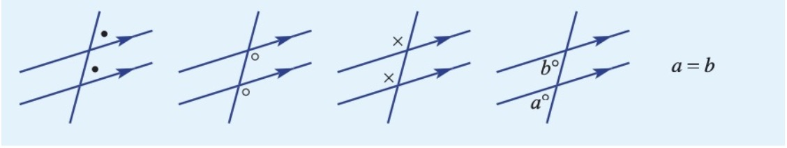
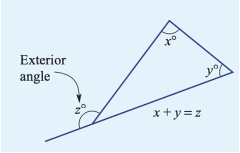

# Year 8 Maths Chapter 6 - Angle relationships and properties of geometrical figures 1
{: .no_toc }
## probably the stupidest section out of this entire website (so much sabotage and silly stuff)... lol good luck
{: .no_toc }

*You will want to refer to [Year 7 Maths Chapter 4](y7c4.html) for basic knowledge of angle relationships. This section is more advanced and omits points, rays, types of angles and other basic concepts.*

#### Table of Contents
{: .no_toc }

* Table of Contents
{:toc}

***

## Angles

* Angles sharing a vertex and an arm are called adjacent angles.
* Two angles in a right angle are adjacent complementary angles. The first angle is the complement of the second angle.
* You can have three or more angles in a right angle. They are not complementary.
* Two angles on a straight line are adjacent supplementary angles. The first angle is the supplement of the second angle.
* You can have three or more angles on a straight line. They are not supplementary.
* Angles at a point and angles in a revolution add up to 360°.
* Where two straight lines meet, they form two pairs of vertically opposite angles. Vertically opposite angles are equal.
* If one of the four angles in vertically opposite is a right angle, then all four angles are right angles. 

**Things you should see (all images are respective to the above bullet points (going down the list, starting from the left [the two images of vertically opposite angles count as one column]):**

A transversal is a line cutting two or more lines.

When a transversal crosses two or more lines, pairs of angles can be:

* Corresponding
* Alternate
* Co-interior
* Vertically opposite
* Angles on a straight line

Corresponding, alternate and co-interior angles, respectively:

Lines are parallel if they will never intersect. They are marked with indented arrows. To mark something as parallel, you use a || sign.

	Let AB be parallel to XY
	∴ AB || XY
	∵ I said so

You read this as:

	Let AB be parallel to XY
	Therefore, AB is parallel to XY
	Because, I said so

Or something along those *lines* (hah, get it?).

If two parallel lines are cut by a transversal...

... then corresponding and alternate angles are equal, while cointerior angles are equal to 180° (supplementary).

**Fun fact!** One way to remember Alternate angles is that they make a Z or a S. Salternate, Zalternate. This is sometimes not recommended by maths teachers are they get confusing.

***

## Polygons

A polygon is a type of shape where the number of interior angles equals the number of sides. Polygons can be convex or non-convex:

- **Convex** polygons all have vertices pointing outside (all exterior angles are reflex angles)
- **Non-convex** polygons have some vertices pointing inwards (at least one exterior angles is not a reflex angle)

A regular polygon has sides of equal length and equal interior angles. For a list of polygons, see [List of n-gon names](#list-of-n-gon-names).

A triangle has:

- 3 sides
- 3 vertices (usually labelled as A, B, and C)
- 1 vertex
- 3 interior angles (usually labelled ∠ABC, ∠BAC, ∠ACB)

Triangles can be classified by interior angles:

- **Acute-angled** triangles are where all angles are acute
- **Right-angled** triangles are where there is one right angle
- **Obtuse-angled** triangles are where there is one obtuse angle

Triangles can also be classified by their side lengths

- **Scalene** triangles are where all sides are different lengths
- **Isosceles** triangles are when there are two sides that are the same length
- **Equilateral** triangles are when all of the sides are of equal length

For these triangles, they have unique properties:

- **Isosceles** triangles have the same base angle
- **Equilateral** triangles have angles that are all 60°

It is important to note that to designate sides as equal you would use a dash, similar to how you would mark parallel lines as we noted earlier.

The angle sum of a triangle is 180°.

#### Angle sum of n-gon

Dr Nguyen (and Osmond Lin’s dead rabbit) wanted to find the interior angle size of a polygon, but he couldn’t remember its angle sum! Dr Nguyen (and Osmond Lin’s dead rabbit) is confuddled, but by using the below steps, he can find his interior angle size of a polygon!

Let n be the number of sides of said polygon.

	180(n - 2) = angle sum of n-gon

For example:

	Where n-gon has 5 sides (pentagon).
	
	180(5 - 2) = angle sum of pentagon
		     = 540°

You can therefore find the size of a single interior angle from this equation

	Where the angle sum of n-gon (pentagon) is 540°
	
	540/n = single interior angle of n-gon
	540/5 = 108°

## Angle sums

The exterior angle theorem dictates that the **exterior angle of a triangle is equal to the sum of the two opposite interior angles.**

For example:

The angle sum of a triangle can be used to prove other theorems, for example, one which relates to the angle in a semicircle. Although this isn’t apart of the main textbook curriculum, it is located in the Enrichment section of the textbook.

Suppose a triangle, `△ABC`, where BC is equal to the diameter of the semicircle, then ∠C is equal to 90°.

As you may recall from [Chapter 3](../y8/y8c3.html), quadrilaterals are four-sided polygons. They include kites, trapeziums (also known as trapezoids in North America), parallelograms, rhombus, rectangles, and squares.

Every quadrilateral have two diagonals, and in some quadrilaterals the diagonals bisect each other (cut each other in half).

Quadrilaterals can be convex or non-convex.

- **Convex** quadrilaterals all have vertices pointing outside (all exterior angles are reflex angles)
- **Non-convex** quadrilaterals have some vertices pointing inwards (one exterior angles is not a reflex angle)

The angle sum of a quadrilateral is 360°.

Quadrilaterals with parallel sides contain two pairs of co-interior angles.

In line and rotational symmetry, the line of symmetry divides a shape into equal parts (mirrored).

The order of rotational symmetry refers to the number of times a figure “coincides with its original position” in turning through one full rotation, according to the textbook.

A better way to put this:

In one full rotation (360° rotation) how many times does the position of the figure match the original position?

For an equilateral triangle, it is the same at the beginning of the rotation, a third of the way through, and another third of the way through, before it returns. If a figure has no rotational symmetry, its order of rotational symmetry is 1.

A polyhedron has the following properties::

- closed solid
- flat surfaces
- vertices and edges
- named after the number of faces

Euler’s formula dictates:

	E = F + V - 2

Where  `F = faces`, `V = vertices` and `E = edges`.

Prisms are polyhedra. They have the following properties:

- two identical/congruent ends, + an identical cross section to the ends
- other faces are parallelograms
- right prisms have all other faces as rectangles
- named after number of parallelograms that make up the solid

Pyramids are polyhedra with a base face, and all other faces meeting at a vertex point; the apex. They are named by the shape of the base.

Solids with curved surfaces include cylinders, spheres and cones. 

Cubes (hexahedron) have 6 square, congruent faces. Rectangular prisms are also known as cuboids. Thanks America™.

Regular polygons include:

### List of n-gon names

1. Henagon
1. Digon
1. Triangle
1. Quadrilateral
1. Pentagon
1. Hexagon
1. Septagon
1. Octagon
1. Nonagon
1. Decagon
1. Undecagon
1. Dodecagon
1. Tridecagon
1. Tetradecagon
1. Pentadecagon
1. Hexadecagon
1. Heptadecagon
1. Octadecagon
1. Enneadecagon
1. Icosagon
1. Icosihenagon
1. Icosidigon
1. Icostrigon
1. Icositetragon
1. Icosipentagon
1. Icosiexagon
1. Icosiheptagon
1. Isocioctagon
1. Icosienneagon
1. Triacontagon
1. Triacontahenagon
1. Triacontadigon
1. Triacontatrigon
1. Triacontatetragon
1. Triacontapentagon
1. Triacontahexagon
1. Triacontaheptagon
1. Triacontaoctagon
1. Triacontaenneagon
1. Tetracontagon
1. Tetracontahenagon
1. Tetracontadigon
1. Tetracontatrigon
1. Tetracontatetragon
1. Tetracontapentagon
1. Tetracontahexagon
1. Tetracontaheptagon
1. Tetracontaoctagon
1. Tetracontaenneagon
1. Pentacontagon
1. Pentacontahenagon
1. Pentacontadigon
1. Pentacontatrigon
1. Pentacontatetragon
1. Pentacontapentagon
1. Pentacontahexagon
1. Pentacontaheptagon
1. Pentacontaoctagon
1. Pentacontaenneagon
1. Hexacontagon
1. Hexacontahenagon
1. Hexacontadigon
1. Hexacontatrigon
1. Hexacontatetragon
1. Hexacontapentagon
1. Hexacontahexagon
1. Hexacontaheptagon
1. Hexacontatoctagon
1. Hexacontaennagon
1. Heptacontagon
1. Heptacontahenagon
1. Heptacontadigon
1. Heptacontatrigon
1. Heptacontatetragon
1. Heptacontapentagon
1. Heptacontahexagon
1. Heptacontaheptagon
1. Heptacontaoctagon
1. Heptacontaenneagon
1. Octacontagon
1. Octacontahenagon
1. Octacontadigon
1. Octacontatrigon
1. Octacontatetragon
1. Octacontapentagon
1. Octacontahexagon
1. Octacontaheptagon
1. Octacontaoctagon
1. Octacontaennagon
1. Enneacontagon
1. Enneacontahenagon
1. Enneacontadigon
1. Enneacontatrigon
1. Enneacontatetragon
1. Enneacontapentagon
1. Enneacontahexagon
1. Enneacontaheptagon
1. Enneacontaoctagon
1. Enneacontaenneagon
1. Hectogon

### and of course going up in hundreds...
{: .no_toc }

    200. Dihectagon
    300. Trihectagon
    400. Tetrahectagon
    500. Pentahectagon
	600. Hexahectagon
	700. Heptahectagon
	800. Octahectagon
	900. Enneahectagon
	1000. Chiliagon
	2000. Dischiliagon
	3000. Trischiliagon
	4000. Tetrakischiliagon
	5000. Pentakischiliagon
	6000. Hexakischiliagon
	7000. Heptakischiliagon
	8000. Octakichiliagon
	9000. Enakichiliagon
	10000. Myriagon
	1000000. Megagon
	∞. Apeirogon

I would just like to reinforce that I typed all of these using my fingers. The only thing copy and pasted was the infinity symbol.

*Brendan’s Note: To type infinity, simply type alt-5. ∞∞∞∞∞∞∞∞∞∞∞∞∞∞∞∞∞∞∞∞!*

Source: https://en.wikipedia.org/wiki/List_of_polygons#List_of_n-gons_by_Greek_numerical_prefixes
