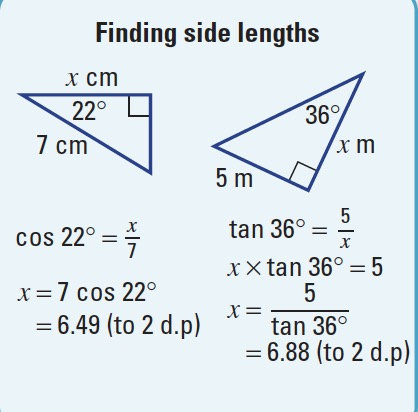
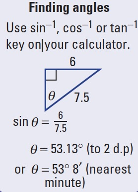
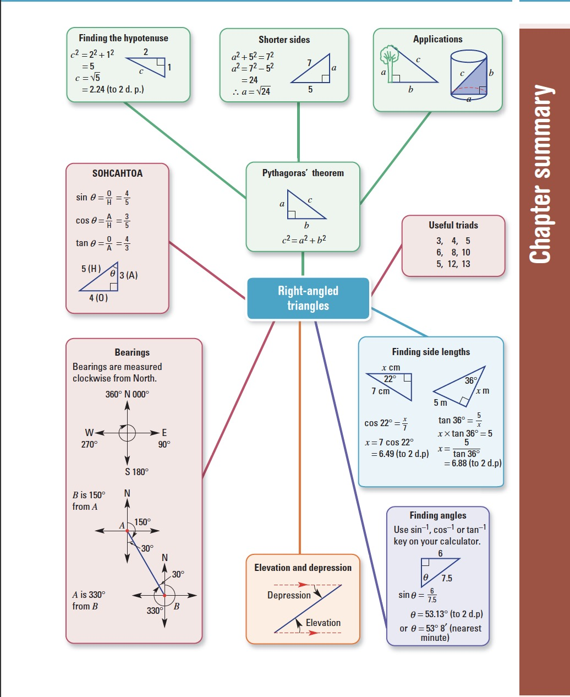

# Year 9 Maths Chapter 3 - Right-angled triangles
{: .no_toc }

## "the earth is flat" – our Year 9 maths teacher 
{: .no_toc }

<label class="label label-green">Complete</label>

*You will want to refer to [Year 8 Maths Chapter 6](../y8/y8c6.html) for basic geometry. This section is more advanced, and omits basic concepts.*

#### Table of Contents
{: .no_toc }

* Table of Contents
{:toc}

***

## Pythag
```
a² + b² = c²
```
where `a` and `b` is the opposite/adjacent, and `c` is the hypotenuse

Pythagorean triads include 3, 4, 5 (because `3² + 4² = 5²`) and 6, 8, 10 (because `6² + 8² = 10²`).

## Trig ratios

Take a right angled triangle with angle `θ`.


* The longest side of the triangle (opposite the right angle) is the **hypotenuse**.
* The side opposite `θ` is the **opposite**.
* The side adjacent to theta is the **adjacent**.

There are trig ratios for these sides: sine, cosine, and tangent, which are abbreviated to `sin`, `cos` and `tan` respectively.

In all of the below ratios, the side in the ratio refers to the length of a corresponding side. E.g opposite over adjacent = length of opposite side over length of adjacent side.

1. Sine ratio
```
        opposite
sinθ = ––––––––––
        adjacent
```

2. Cosine ratio
```
         adjacent
cosθ = ––––––––––––
        hypotenuse
```

3. Tangent ratio
```
        opposite
tanθ = ––––––––––
        adjacent
 ```

This can be remembered using the term: 

### SOH CAH TOA


### Finding sides

[More on Finding Sides at Khan Academy](https://www.khanacademy.org/math/geometry/hs-geo-trig/hs-geo-solve-for-a-side/a/unknown-side-in-right-triangle-w-trig){: .btn .btn-green}

1. Find trig ratio
2. With the trig ratio, replace θ with the (acute) angle stated
3. Insert a pronumeral for the unknown side, into the trig ratio
4. Solve



### Finding angles

1. Find trig ratio
2. Insert the appropriate sides into their corresponding positions on the trig ratio
3. Use sin⁻¹(your ratio here) to solve for the unknown angle


 
## Angles of elevation and depression

[More at Khan Academy on Angles of Elevation and Depression](https://www.khanacademy.org/math/geometry/hs-geo-trig/hs-geo-modeling-with-right-triangles/a/angles-of-elevation-and-depression){: .btn .btn-green}

* The angle of **elevation** is how big the angle between a horizontal and a line of sight is. e.g when you look up, you are forming an angle of elevation
* Similarly, the angle of **depression** is how big the angle between a horizontal and line of sight is, but instead of being up, it is down


oof that meme

## Bearing

Measured clockwise from north


## Chapter 3 Summary



