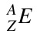
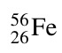
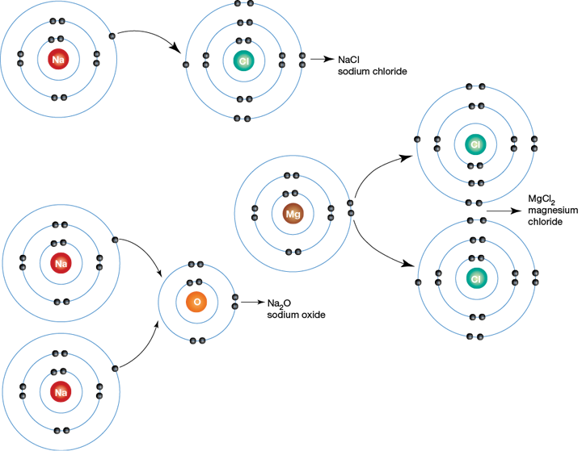
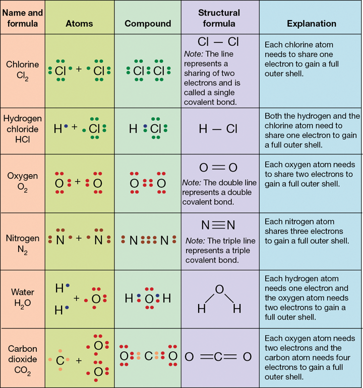

# Chemistry 1
{: .no_toc }
## also known as Chemistry – the inside story
{: .no_toc }

<label class="label label-blue">In-Progress</label>

#### Table of Contents
{: .no_toc }

* Table of Contents
{:toc}

*Hey there! Please be advised if you're an* <label class="label label-blue">Aloys</label> *boi this doesn't exactly match your textbook! I've tried to keep similar concepts together so if you can't find something, feel free to use the textbook, or use that neat little search bar up the top there! Thanks!*

***

## Model of an atom

Model of an atom:

1. Small and dense nucleus made up of:
    2. neutrons (uncharged particles)
    2. protons (positively charged particles)
1. Surrounded by rapidly moving electrons
1. Held together through nuclear forces

*Particles with the same charge **repel each other**.*
*Particles with opposite charges **are attracted to each other**.*

Most volume of the electron is made up of empty space.

* Electrons == 1/2000th size of protons and neutrons.
* Electrons have electrical charge of -1
* Protons have electrical charge of +1
* Neutrons have no electrical charge
* Atoms usually have the same number of electrons as neutrons
* Electrons move rapidly around the nucleus, in regions known as [electron shells](#electron-shells)

* In the nucleus: protons and neutrons
* Surrounding the nucleus: electrons

**The number of protons in an atom determines what type of atom it is**

e.g gold atom has 79 protons

***

## Electrons
### and the 2, 8, 18 rule
{: .no_toc }

Electrons fill electron shells. The number of electrons a shell can fit increases as the shell's distance from the nucleus increases. The outermost shell is called the valence shell.

The numnber of electrons a shell can hold is equal to `2n^2` where n is the shell number.

Therefore:
```
2 × 1^2 = 2 (for shell one)
2 × 2^2 = 8 (for shell two)
2 × 3^2 = 18 (for shell three)
```
and so on. This is called the **2, 8, 18 rule**. Electrons fill from the inner most shell going outwards. You can see a diagramatic representation on this electron dot diagram.

*The 2, 8, 18 rule has some caveats though. See [Shells!](#shells) for more information.*


#### Examples of electron configurations

Aluminium has 13 protons, therefore aluminium's **electron configuration** is `2, 8, 3`

Sodium has 11 protons, therefore sodium's **electron configuration** is `2, 8, 1`

Oxygen has 8 protons, therefore sodium's **electron configuration** is `2, 6`

#### Excited atoms

When an atom is excited it may "jump" to a higher electron shell. They drop back down and release **light energy**.

#### Groups in the Periodic Table

There are 18 groups in the periodic table. Here are some important ones.

| Group      | Name                  | Other                                             |
|------------|-----------------------|---------------------------------------------------|
| Group 1    | Alkali metals         | React strongly with water to form basic solutions | 
| Group 2    | Alkaline earth metals | Highly reactive                                   |
| Group 17   | Halogens              | Non-metal elements                                |
| Group 18   | Noble gases           | Inert elements that aren't that reactive          |
| Group 3-12 | Transition metals     | Metallic elements                                 |

***

## Atomic numbers and mass numbers

### Atomic number

We know that the number of protons an atom has dictates what atom it is. In the periodic table, this is known as the atomic number.

```
Number of protons == Number of electrons == Atomic number
e.g Chlorine has 17 protons therefore it's atomic number is 17
```

Atoms are electrically neutral and must have **the same number of electrons as protons**. Otherwise, they become ions.

### Mass number

```
Mass number == number of protons + number of neutrons
```

Electrons are too small to be counted.

### Subatomic particles

You can represent the mass number and atomic number of an element like this:



where:
- `A` is the atomic number
- `Z` is the mass number, and
- `E` is the element symbol.

For example, for the element iron,



You can use this information to calculate the number of neutrons...
    number of neutrons = A − Z = 56 − 26 = 30


... and the number of electrons or the number of protons.
    number of electrons = number of protons = Z = 26

***

## The Periodic Table

Metalloids are elements that have properties of both metals and non-metals. On the periodic table they sort of zig zag. There are more cool patterns too...

| Characteristic                | Pattern down a group                                            | Pattern across a period                                                                  |
|-------------------------------|-----------------------------------------------------------------|------------------------------------------------------------------------------------------|
| Atomic number and mass number | Increases                                                       | Increases                                                                                |
| Atomic radius                 | Increases                                                       | Decreases                                                                                |
| Melting points                | Decreases for groups 1 to 5 and increases for groups 5 to 8     | Generally increases then decreases                                                       |
| Reactivity                    | Metals become more reactive and non-metals become less reactive | Is high, then decreases and then increases. Group 8 elements are inert and do not react. |
| Metallic character            | Increases                                                       | Decreases                                                                                |

### Shells!

- The largest atoms have up to seven electron shells, therefore, there are seven periods.
- The period tells you the number of electron shells.
- The third shell can hold up to 18 electrons but any shell with more than 8 electrons become unstable. Therefore, after 8 electrons the fourth shell starts to fill.
- From scandium to zinc (21 - 30) which are transition metals, the third shell fills, and then the fourth shell continues to fill up.

### Valencies

You need to know your valencies in the periodic table. You can write valencies above the group on your periodic table, or refer to this table.

| Group             | Valency |
|-------------------|---------|
| Group 1           | 1       |
| Group 2           | 2       |
| Group 3           | 3       |
| Group 4, group 14 | 4       |
| Group 15          | 3       |
| Group 16          | 2       |
| Group 17          | 1       |

This will be **really** helpful for naming chemical formulas of ionic and covalent compounds later on.

***

## Ions

Ions are atoms that have gained or lost electrons. It means they have an electric charge. Positive ions have more protons than electrons, and vice versa. When the outer shell is filled atoms tend to be more stable (which is why it's cool to be noble – elements with full valence electrons).

For example, a sodium atom might need to lose an electron to have a full valence shell, and a chloride atom might need to gain an electron to have a full valence shell. The sodium atom can lose an electron to the chloride atom and now both atoms have full valence shells.

### Naming ions

Positive ions are called **cations**, while negative ions are called **anions**. Cations keep their original name (e.g boron, lithium, etc) while negative ions have the -ide suffix (e.g flouride, nitride, etc).

#### Common ions

| Atom name     | Ion name  | Chemical symbol | Atom name     | Ion name | Chemical symbol |
|---------------|-----------|-----------------|---------------|----------|-----------------|
| lithium       | lithium   | Li+             | iodine        | iodide   | I−              |
| sodium        | sodium    | Na+             | fluorine      | fluoride | F−              |
| potassium     | potassium | K+              | chlorine      | chloride | Cl−             |
| calcium       | calcium   | Ca2+            | oxygen        | oxide    | O2−             |
| aluminium     | aluminium | Al3+            | nitrogen      | nitride  | N3−             |

## Ionic compounds

- The outer electrons of atoms interact with other electrons, and the become chemically joined to form molecules.
- This is known as a chemical bond.
- Molecules between atoms of different elements become a compound.
- Noble gases with stable electron configurations and full valence shells don't react to form compounds.
- Compounds where atoms lose and gain electrons are called ionic compounds.
- Sodium chloride, copper sulfate and calcium carbonate are examples of ionic compounds. 
- Ionic compounds occur where metal and non-metal atoms combine. This creates an ionic bond.ionic



Ionic compounds usually:

1. are made up of positive and negative ions
2. are solids at room temperature
3. dave high melting points
4. dissolve in water
5. when dissolved to become an aqueous solution, this soltuion is usually conductive to electricity

### Naming an ionic compound[^1]

You can solve for a metal and a non-metal's ionic compound chemical formula using the cross method.

> REMEMBER: Cations first!

#### Explanation[^2]

    Find the chemical formula for iron(III) bromide.

> NB: Note that electrovalency, valency, and charges are sometimes interchangably. They are similar but not the same.
> NOTICE that iron is a metal and bromide is a non-metal.

To determine the formula of an **ionic compound**, you need to balance the charges (electrovalencies). Compounds have to be **electrically neutral**. To do this:

1. Find electrovalencies of the ions in the compound. For example:
    Iron has a charge of +3
    Bromide has a charge of -1
2. Figure out how many negative ions you need to balance out positive ions, and vice versa. 
```
To balance out iron's charge of +3, you need 3 bromide ions. Therefore,
    1x iron ion
        charge of single iron(III) ion == +3
        total charge of 1x iron ion == +3
    3x bromide ion
        charge of single bromide ion == -1
        total charge of 3x bromide ion == -3
∴ iron total charge of +3 balances with bromide total charge of -3
```
3. Write the formula.
    One iron ion, three bromide ions
    ∴ FeBr₃ is the chemical formula for iron(III) bromide

#### Crossover method

An easy method to determine ionic compound formulae.

1. Take a metal and a non-metal. For this example, we will use magnesium and chloride.
2. Write their corresponding valencies without + or - under them. For example, magnesium's valency is +2 and chloride's valency is -1. 
3. "Cross over" these valencies. Therefore, we end in `MgCl2`.
```
Mg      Cl
+2      -1
 2       1
# cross over
   MgCl2
```

Remember, the elements need to achieve **electrical neutrality**.  How many `Cl` ions do you need to neutralise `Mg`?

Monoatomic ions such as aluminium ion, oxide ion and sodium ion contain one symbol. If you receive a radical or a **group of atoms with one singular charge** it is known as a polyatomic ion. These include  nitrate (NO₃ - overall charge 1-), sulfate (SO₄ - overall charge 2-) and phosphate (PO₄ - overall charge 3-)

> QUICK NOTE: Radicals are groups of atoms with an overall charge.

See the example below for a demonstration on hwo to deal with polyatomic ions.

#### Examples

***

## Covalent compounds

Atoms can share electrons to create a covalent bond. Covalent molecules can be between more than one type of atom or atoms of the same element. For example, oxygen gas (O2) is made up of two oxygen atoms sharing electrons.

Elements combine and share electrons to achieve full electron shells. Here are some common covalent molecules.



Covalent compounds usually:

1. are gases, liquids, or solids with low melting points
2. aren't electrically conductive
3. insolube in water

### Naming a covalent compound

***

## Balancing chemical equations

[See more at In a Nutshell: Equations](equations.html){: .btn .btn-green}

While it may be easy to write word equations like
```
Magnesium metal + hydrochloric acid –> hydrogen gas + magnesium chloride
```
writing *chemical* equations are a bit different.

Here, have an easy one.
```
H₂ + O₂ –> H₂O
```

The reactant side (`H₂ + O₂`) has one more oxygen atom than the product side (`H₂O`). Therefore, we need to multiply the atoms to balance the equation.

We do that by writing a number in front of a formula, which **multiplies ALL of the atoms in that formula by that number**. For example, if we write 2 in front of the hydrogen gas on the reactant side and water on the product side...
```
2H₂ + O₂ –> 2H₂O
```

Suddenly we have balanced the equations. Now, there are 4 hydrogen and 2 oxygen on each side.

Here are some more fun ones to do. Use the table for common ionic and covalent compounds. Answers are below.

#### Activity

1. Carbon monoxide gas + oxygen gas –> carbon dioxide gas
{: .no_toc}
2. Sodium hydroxide + hydrochloric acid –> sodium chloride + water
{: .no_toc}
3. Mercury + oxygen gas –> mercury(II) oxide
{: .no_toc}
4. Magnesium metal + hydrochloric acid –> hydrogen gas + magnesium chloride
{: .no_toc}
5. Sodium + water –> hydrogen gas + sodium hydroxide gas
{: .no_toc}
6. Copper sulfate + sodium hydroxide –> copper hydroxie + sodium sulfate
{: .no_toc}

#### Common ionic and covalent compounds

**Compound**|**Formula**
:-----:|:-----:
**Ionic compound**| 
Sodium hydroxide|NaOH
Sodium chloride|NaCl
Magnesium chloride|MgCl₂
Copper hydroxide|Cu(OH)₂
Sodium sulfate|Na₂SO₄
Copper sulfate|CuSO₄
Sodium hydrogen carbonate|NaHCO₃
Mercury(II) oxide|HgO
Sodium citrate|C₆H₅O₇Na₃
**Covalent compounds**| 
Water|H₂O
Citric acid|C₆H₈O₇
Carbon dioxide|CO₂
Oxygen|O₂
Hydrochloric acid|HCl
Carbon monoxide|CO
Hydrogen|H₂

#### Answers

Feel free to email me using the link in the top-right corner if something is wrong. The text is purposely really dark to avoid you cheating, but it may help to highlight it when you are checking it with your cursor to make it more readable.

##### 1. 2CO₂ + O₂ –> 2CO₂
##### 2. NaOH + HCl –> NaCl + H₂O
##### 3. 2Hg + O₂ –> 2HgO
##### 4. Mg + 2HCl –> H₂ + MgCl₂
##### 5. 2Na + 2H₂O –> H₂ + 2NaOH
##### 6. CuSO₄ + 2NaOH –> Cu(OH)₂ + Na₂SO₄

***

## Footnotes and Other Notes

[^1]: Chapter 5.8, Finding the Right Formula – Core Science Stage 5 NSW Australian Curriculum Second Edition
[^2]: Formulas for Ionic Compounds – Chemistry 101 Class Notes at Indiana University Northwest http://www.iun.edu/~cpanhd/C101webnotes/composition/formioncmpds.html
