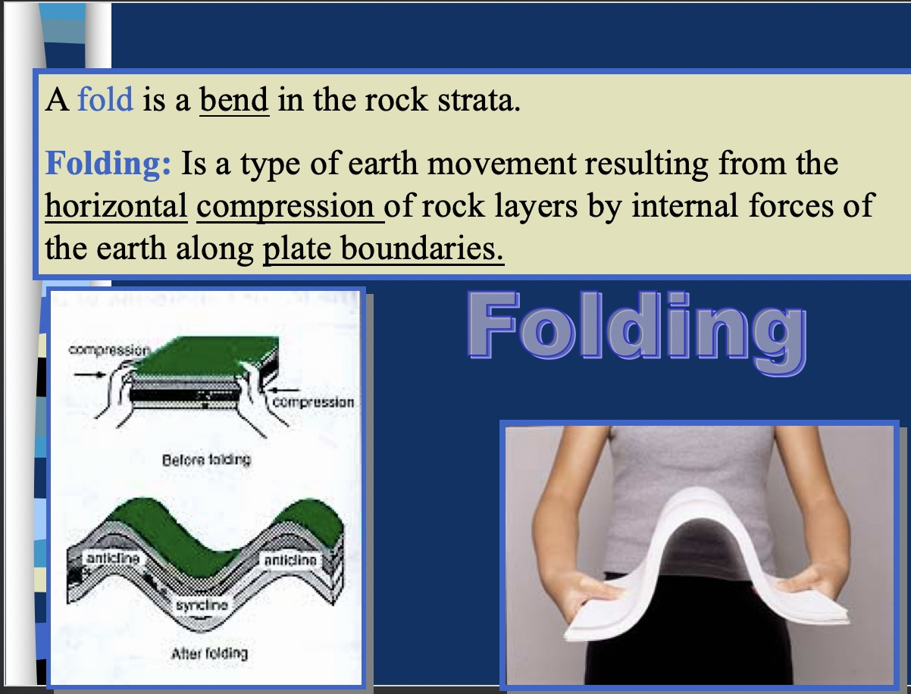

# Tectonic Plates
{: .no_toc }

## The Earth, in a nutshell
{: .no_toc }

<label class="label label-green">Complete</label>

#### Table of Contents
{: .no_toc }

* Table of Contents
{:toc}

***

Earth is made up of tectonic plates; plates of crust that float on the mantle. Here’s a table of the different parts of the Earth.

| Part of the Earth | Description            |
|-------------------|------------------------|
| Crust             | Thin and rocky         |
| Mantle            | Semi-molten rock       |
| Outer Core        | Liquid nickel and iron |
| Inner Core        | Solid nickel and iron  |

Sometimes we refer to them in regions.

| Part of the Earth | Description                       |
|-------------------|-----------------------------------|
| Lithosphere       | Made up of crust and upper mantle |
| Aesthenosphere    | Below the lithosphere             |

Earth's crust is a thin and rocky section of the Earth that is about 8km thick. It floats on top of semi-molten rock in the mantle, which in turn floats on nickel and iron. 

## Wegener's Theory of Continental Drift

Alfred Wegener theorised that the Earth’s crust was made up of plates that were floating on denser magma. This was called the theory of **continental drift**. Today, the theory of tectonic plates succeeds continental drift theory. He also theorised that the continents of the world used to be one gigantic supercontinent, which he named Pangea. There were a number of different supercontinents as land broke away and joined together repeatedly. 

### Evidence for the theory of continental drift

Evidence for this includes:

1. The east coast of South America and the west coast of South America match up together

2. There are similar patterns for rocks on different continents (e.g the Appalachian Mountains in North America seem to continue into the Caledonian Mountains in Scandinavia)

3. Similar fossils have been found on different continents, for example, fossils of the Mesosaurus have been found in both in both South Africa and Brazil. Cold areas such as Greenland have tropical fossils, and South Africa has ice scratches on rocks despite it's warm climate.

4. There are coal deposits in cold parts of the world (such as Antarctica) and glacial deposits in hot parts of the world (such as South Africa, Australia, South America and India) which seems to suggest that these landmasses were once joined together.

5. Tectonic and seismic activity seems to concentrate on the boundaries of the plates, known as the Ring of Fire. 

6. The magnetic north pole continually moved around[^2]

Tectonic activity is the reason that our natural terrain is extremely varied. The Mid-Ocean Ridge and Marianas Trench are some examples of terrain formed by a divergent boundary and a convergent boundary respectively. The San Andreas Fault in California is a good example of a transform boundary.

***

## Moooooove over!

### How do plates move?

Plates move in three primary ways[^1].

1. ### Divergent Boundaries
    Divergent boundaries are when two plates separate and move away from each other. 
    

2. ### Convergent Boundaries
    Convergent boundaries are when two plates move towards each other, forcing one plate to dive beneath the other. This process is known as **subduction**.
    

3. ### Transform Boundaries
    Transform boundaries are when two plates slide past each other, causing a fault. A good example of a transform boundary is the San Andreas Fault in California, United States.
    

## Why do plates move?

Plates move because of convection currents in the molten liquid rock in the mantle. 

Heat generated from the really hot outer core rises, and when it gets to the top, is blocked by the crust, spreads out at the top, and falls when it begins to cool. This moves the boundaries of the plates. As a result, the crust is affected by changing boundaries and this is what causes magma to upwell, usually at the site of divergent boundary (volcanic activity).

## History of Tectonic Plates[^2]

Alfred Wegener proposed the theory of continental drift, and that continents "plower This was due to the geographical evidence where coastlines fit together. Paleontologists – fossil scientists, found fossils on different continents. Moving into the present, underwater seisometers meant to alert nuclear activity showed that there was increased volcanic and seismic activity around the edges of plates. This, which occurred in the 1960s, basically made plate tectonic theory the dominant accepted theory for how the Earth was shaped.

***

## Folds, Faults and Subduction

### Folding[^3]

* Earth's crust bends, and this causes folding
* When plates collide and are forced into each other, folding occurs. This process is known as compression.
* Horizontal compression occurs which creates mountains.
* This process occurs at **collision zones**.

In folding mountains, the part folded upwards is the anticline and the part folded downwards is the syncline.

[More on Fold Mountains on BBC Bitesize GCSE Geography](https://www.bbc.co.uk/bitesize/guides/zyfxdmn/revision/1){: .btn .btn-purple}

### Faults

* Tectonic plates horizontally slip
* This process is known as **rifting**, where the lithosphere is torn apart

In fault-block mountains, the raised block is the **horst** while the lowered block is the **graben**.

### Subduction[^6]

[Destructive Plate Margins on BBC Bitesize](https://www.bbc.co.uk/bitesize/guides/zss8rwx/revision/5){: .btn .btn-green}

* A geological process at convergent boundaries, where one plate dives under another
* Most common with an oceanic plate, and a continental plate
* The oceanic plate is denser, and it moves below the continental plate
* This triggers earthquakes
* This process occurs at the **subduction zone**.

When subduction occurs, it usually means that crust will be subducted too. This means that mantle from the asthenosphere will be upwelled to form new crust.

## Earthquakes

Seismic and volcanic activity are more likely at the boundaries of tectonic plates. Most of the sliding, pushing, pulling, seafloor spreading and upwelling occurs along the tectonic plates. A large number of earthquakes and volcanic activity occur around the Pacific Plate. This is known as the Ring of Fire.

We can measure how much energy an earthquake produces using the Richter scale, which is a scale of magnitude. Every increase of 1 on the scale is an increase of amplitude by 10. **Familiarise yourself with the Richter scale now.**

| Magnitude       | Description | Mercalli intensity | Average earthquake effects                                                                                                                                                                                                                                                                                                             | Average frequency of occurrence globally (estimated) |
|-----------------|-------------|--------------------|----------------------------------------------------------------------------------------------------------------------------------------------------------------------------------------------------------------------------------------------------------------------------------------------------------------------------------------|------------------------------------------------------|
| 1.0–1.9         | Micro       | I                  | Microearthquakes, not felt, or felt rarely. Recorded by seismographs.[30]                                                                                                                                                                                                                                                              | Continual/several million per year                   |
| 2.0–2.9         | Minor       | I to II              | Felt slightly by some people. No damage to buildings.                                                                                                                                                                                                                                                                                  | Over one million per year                            |
| 3.0–3.9         |             | III to IV            | Often felt by people, but very rarely causes damage. Shaking of indoor objects can be noticeable.                                                                                                                                                                                                                                      | Over 100,000 per year                                |
| 4.0–4.9         | Light       | IV to VI             | Noticeable shaking of indoor objects and rattling noises. Felt by most people in the affected area. Slightly felt outside. Generally causes none to minimal damage. Moderate to significant damage very unlikely. Some objects may fall off shelves or be knocked over.                                                                | 10,000 to 15,000 per year                            |
| 5.0–5.9         | Moderate    | VI to VII            | Can cause damage of varying severity to poorly constructed buildings. At most, none to slight damage to all other buildings. Felt by everyone.                                                                                                                                                                                         | 1,000 to 1,500 per year                              |
| 6.0–6.9         | Strong      | VIII to X            | Damage to a moderate number of well-built structures in populated areas.Earthquake-resistant structuressurvive with slight to moderate damage. Poorly designed structures receive moderate to severe damage. Felt in wider areas; up to hundreds of miles/kilometers from the epicenter. Strong to violent shaking in epicentral area. | 100 to 150 per year                                  |
| 7.0–7.9         | Major       | X or greater  | Causes damage to most buildings, some to partially or completely collapse or receive severe damage. Well-designed structures are likely to receive damage. Felt across great distances with major damage mostly limited to 250 km from epicenter.                                                                                      | 10 to 20 per year                                    |
| 8.0–8.9         | Great       |                    | Major damage to buildings, structures likely to be destroyed. Will cause moderate to heavy damage to sturdy or earthquake-resistant buildings. Damaging in large areas. Felt in extremely large regions.                                                                                                                               | One per year                                         |
| 9.0 and greater |             |                    | At or near total destruction – severe damage or collapse to all buildings. Heavy damage and shaking extends to distant locations. Permanent changes in ground topography.                                                                                                                                                              | One per 10 to 50 years                               |

***

### Tsunamis

Many earthquakes occur underwater. When earthquakes occur, they can trigger waves. Waves travel long distances, and as the water gets shallower, the waves slow down. Then, they become higher and more closely packed. Adrian personally suggests you to check Tsunamis on BBC Bitesize for a better understanding!

[Tsunamis on BBC Bitesize GCSE Edexcel](https://www.bbc.co.uk/bitesize/guides/zw7s4j6/revision/7){: .btn .btn-green }

***

## Lava and Magma

NOTE: Volcanoes will remain somewhat <label class="label label-yellow">Redundant</label> because it isn't being covered at Adrian's school. If you'd like to contribute, feel free to. Otherwise, please check out [BBC Bitesize's information on volcanoes](https://www.bbc.co.uk/bitesize/guides/zgh79qt/revision/1)

Volcanoes are formed when magma escapes through cracks in the crust and spews out as lava.

Magma is molten rock. Then, when it escapes, it cools down and hardens as lava.

***

## Straya

Australia lies in the centre of the Australian plate, which keeps it relatively immune from seismic and volcanic activity. As the mainland is not near any plate boundaries it doesn't occur near Australia a lot. This makes Australia quite a stable continent.

***

## Footnotes and Other Notes

[^1]: [Tectonic Plates on BBC Bitesize](https://www.bbc.co.uk/bitesize/guides/z79mtv4/revision/3)
[^2]: [Southern Californian Earthquake Center at the University of Southern California and NASA Jet Propulsion Labatory – Integrated GPS Network Education Module](http://scecinfo.usc.edu/education/k12/learn/plate2.htm) (yes it's from 1998 I know okay)
[^3]: [Dr Jon Tso at Radford University in Radford, Virginia, United States](https://www.radford.edu/jtso/GeologyofVirginia/Structures/GeologyOfVAStructures4-2e.html)
[^4]: [KS1 and KS2 Earthquakes](https://www.theschoolrun.com/homework-help/earthquakes)
[^5]: [British Geological Survey](https://www.bgs.ac.uk/discoveringGeology/hazards/earthquakes/seismicWaves.html)
[^6]: [Destructive Plate Margins on BBC Bitesize](https://www.bbc.co.uk/bitesize/guides/zss8rwx/revision/5)
